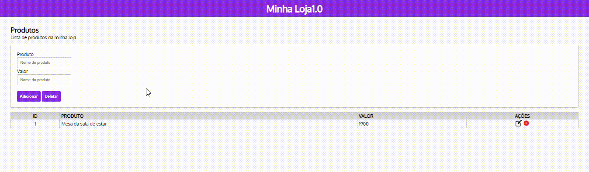

### 🎶Índice

[Lojinha Documentada](#lojinha-documentada)  
[Descrição](#descri%C3%A7%C3%A3o)  
[Instalação](#instala%C3%A7%C3%A3o)  
[Tecnologias utilizadas]()  
[Autores](#autores)  
[Documentação enquanto projeto]()  

### 💕lojinha documentada

### ❤️Descrição
Trabalho de recuperação do segundo trimestre. Sobre documentar as coisas no readme.
 - Informações para o Professor: O JavaScript não está inteiro, e logo não está funcionando igualmente ao video, pois o desenvolvedor do código não ensina a funcionar.

### 😍Instalação
Aqui começamos a explicar as coisas e o que fazer. 
Para tudo funcionar após você ter instalado, verifique os arquivos conectados, se etão no lugar certo e com nomes certos conectados ao html.

### 💖Tecnologias utilizadas

#### VSCODE
- Version: 1.80.2 (system setup)  
- Commit: 2ccd690cbff1569e4a83d7c43d45101f817401dc  
- Date: 2023-07-27T20:40:28.909Z  
- Electron: 22.3.14  
- ElectronBuildId: 22695494  
- Chromium: 108.0.5359.215   
- V8: 10.8.168.25-electron.0  
- OS: Windows_NT x64 10.0.22000  

### 🥰Autores
* [Programador Espartano] ProgramadorEspartano
* [Marsh](https://github.com/MarshyyUWU)

### 💞DOCUMENTAÇÃO ENQUANTO PROJETO
- 7:20 - 15/08/2023
Abri o video e comecei a copiar o código do Programador apra conseugir documentar cada passo, mas facil acesso.
E pelo o que eu já tenho copiado, já começou com os botões de excluir e adicionar.

- 7:54 - 15/08/2023
O arquivo agora tem um css, uma fonte que foi pega do google fonts foi adicionada com algumas pequenas alterações da atualização anterior.

- 8:06 - 15/08/2023
Agora adicionei dois campos com texto podendo ser inserido. Do valor e do produto.

- 8:14 - 15/08/2023
No Css, adicionei O card, deixando tudo mais bonitinho, e agora iniciando a estilização dos botões Input. Um processo rapido, para começar a configuração manual em html java.

- 8:29 - 15/08/2023
Adicionei agora o inicio da tabela com a lista, como a aula vai acabar, vou dar um tempo. Precisa ser terminado o código que está sendo escrito no html no momento [12:13/19:50] do video.

- 7:14 - 22/08/2023
Agora com uma Borda usando o elemento table, ela já sendo colorida de algo claro, estando tambem. Bem fina.

- 7:24 - 22/08/2023
Imagens foram postas e centralizadas.

- 7:40 - 22/08/2023
Agora com JavaScript incluido.

### 😘Agradecimentos!
Espero que eu receba uma boa nota, pois mesmo eu não sabendo a documenação certa no início, tentei fazer tudo ficar coerente ao exemplo demonstrado.
